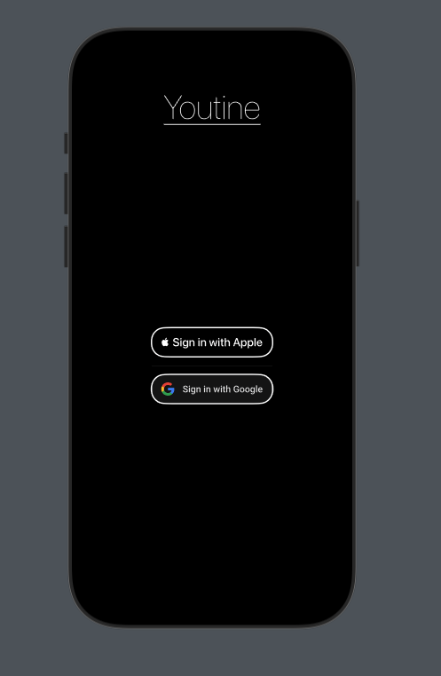

#  Youtine

Habit tracker/routine builder app. The name comes from a play on
words of 'You' and 'Routine', reminding the user that these Routines
are to reinforce positive habits that benefit you.

Takes idea of simple todo app but incoporates habit
building tips/suggestions from Atomic Habits by James Clear.


## Screenshots

### Login
)

### Home


### Routine Detail


### Edit Routine


### Confirmation Dialog (included save + delete))


## Swift Data Integration
Swift Data is a modern, pure-code framework developed by Apple. Though Core Data
is still widely used, Swift Data reduces overhead with its macros-based approach (@Query/@Model) and
integrates nicely with SwiftUI. I am using this [article](https://www.hackingwithswift.com/articles/263/build-your-first-app-with-swiftui-and-swiftdata) currently as reference.

### From Routine.swift
```Swift
//
//  Routine.swift
//  Youtine
//
//  Created by Bobby Guerra on 1/13/25.
//

import SwiftData
import SwiftUI

@Model
class Youtine: Identifiable {
    var id: UUID
    var index: Int
    var start: String
    var daysJSON: String // Store days as JSON string
    var borderColor: String
    @Relationship(deleteRule: .cascade) var habits: [Habit] // Proper relationship

    init(
        index: Int,
        start: String,
        days: [Int: String],
        borderColor: Color,
        habits: [Habit]
    ) {
        self.id = UUID() // Generate a unique identifier
        self.index = index
        self.start = start
        self.daysJSON = Youtine.encodeDays(days)
        self.borderColor = borderColor.description
        self.habits = habits
    }
    

    // Helper to encode days dictionary into JSON
    static func encodeDays(_ days: [Int: String]) -> String {
        guard let data = try? JSONEncoder().encode(days),
              let jsonString = String(data: data, encoding: .utf8) else {
            return "{}" // Return empty JSON if encoding fails
        }
        return jsonString
    }

    // Helper to decode days JSON back into a dictionary
    static func decodeDays(_ daysJSON: String) -> [Int: String] {
        guard let data = daysJSON.data(using: .utf8),
              let decoded = try? JSONDecoder().decode([Int: String].self, from: data) else {
            return [:] // Return empty dictionary if decoding fails
        }
        return decoded
    }
}

@Model
class Habit: Identifiable {
    var id: UUID
    var label: String
    var desc: String
    var completed: Bool
    
    init(label: String, desc: String) {
        self.id = UUID()
        self.label = label
        self.desc = desc
        self.completed = false
    }
}

```
Swift Data methods are used in subviews on form submission and routine deletion. They are declared in Content View so we can attach them as environment vars to the rest of the view hierarchy. 
This gives us a way to propagate operations without needing to explicitly define them as properties inherited by a subview. 

## Firebase Integration
Firebase is a convenient BaaS that offers of a suite of feature such as storage, authentication, cloud functions, etc. For the scope of this project,
I plan to only take advantage of authentication and cloud storage. The application currently supports Federated sign in using either Apple or Google.
I've avoided adding sign in with email and password to create as seamless of a sign in experience as possible.

                                                      
### Todos
[X] Build out display for empty container view (no local data persisted/previous routines saved)

[X] Complete refactor of View Hierarchy and respective subview hierarchy

[X] Finish building out Routine creation screen

[X] Finish building out Edit creation screen

[X] Create ManageRoutineView to conditionally intialize state variables and serves said state to EditRoutineView

[X] Integrate Swift Data

[X] Create environment vars and functions to attach to view hierarchy to execute Swift Data operations

[X] Create disclosure group for HabitListView (

[X] Add state / env var to denote the state (create | edit)

[X] Dynamically change Title/Toolbar labels/Confirmation descriptions

[X] Create push notifications for user that remind them a Routine has commenced

[X] Integrate Firebase Authentication

[X] Add support for Apple and Google federated sign in

[ ] Create unit tests

