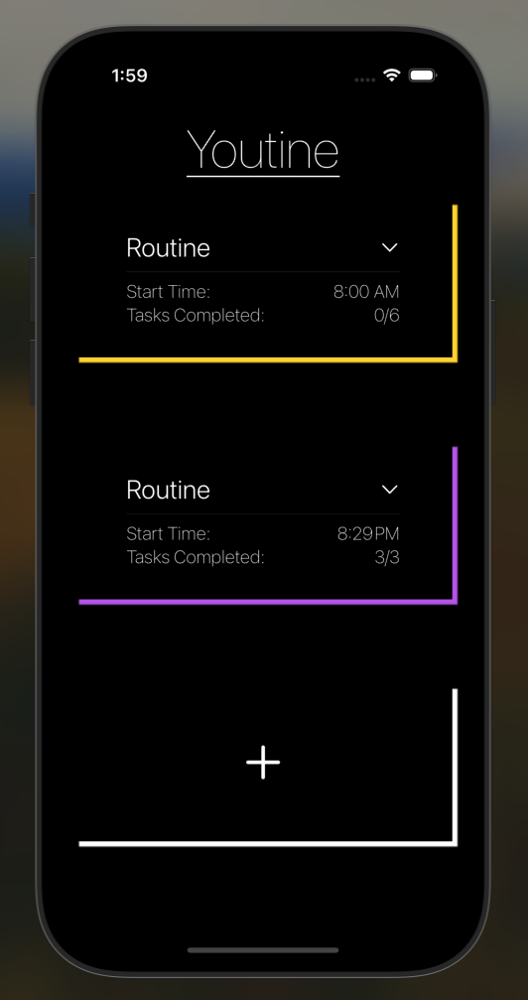
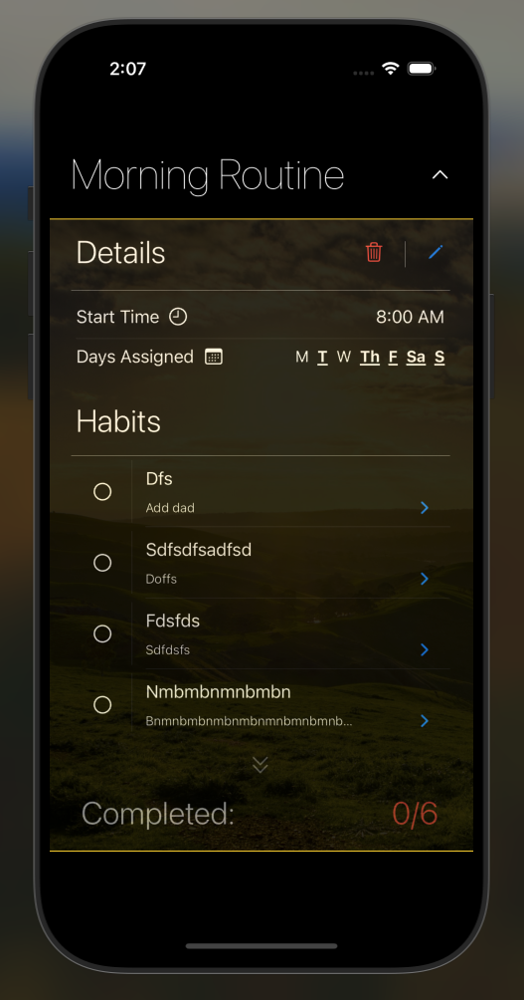
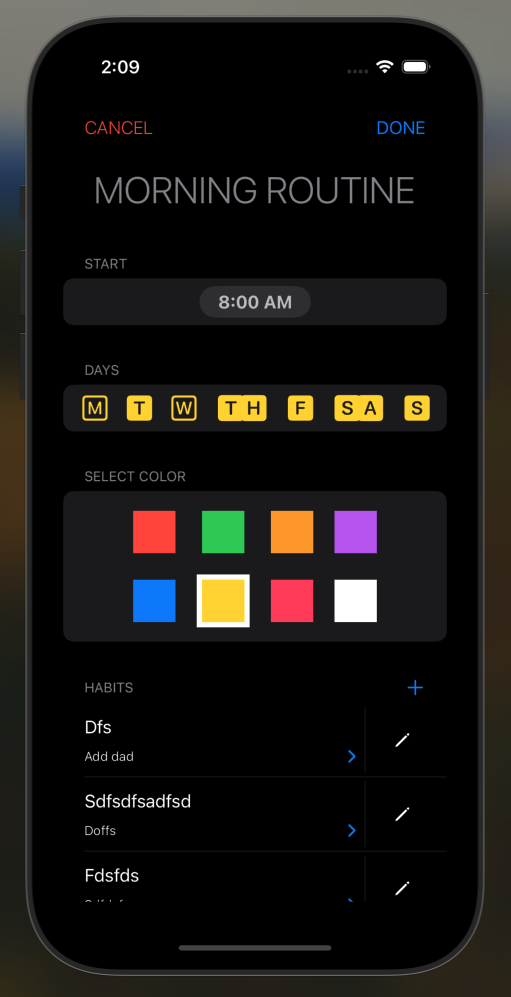
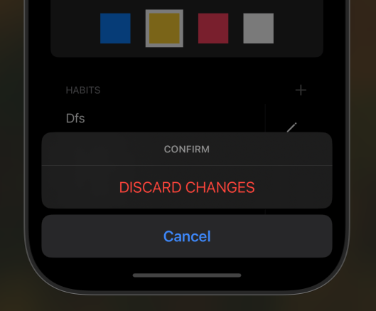

#  Youtine

Habit tracker/routine builder app. The name comes from a play on
words of 'You' and 'Routine', reminding the user that these Routines
are to reinforce positive habits that benefit you.

Takes idea of simple todo app but incoporates habit
building tips/suggestions from Atomic Habits by James Clear.


## Screenshots

### Home


### Routine Detail


### Edit Routine


### Confirmation Dialog (included save + delete))


### Data Model (evolving)
```Swift
//
//  Routine.swift
//  Youtine
//
//  Created by Bobby Guerra on 1/13/25.
//

import SwiftData
import SwiftUI

@Model
class Youtine: Identifiable {
    var id: UUID
    var index: Int
    var start: String
    var daysJSON: String // Store days as JSON string
    var borderColor: String
    @Relationship(deleteRule: .cascade) var habits: [Habit] // Proper relationship

    init(
        index: Int,
        start: String,
        days: [Int: String],
        borderColor: Color,
        habits: [Habit]
    ) {
        self.id = UUID() // Generate a unique identifier
        self.index = index
        self.start = start
        self.daysJSON = Youtine.encodeDays(days)
        self.borderColor = borderColor.description
        self.habits = habits
    }
    

    // Helper to encode days dictionary into JSON
    static func encodeDays(_ days: [Int: String]) -> String {
        guard let data = try? JSONEncoder().encode(days),
              let jsonString = String(data: data, encoding: .utf8) else {
            return "{}" // Return empty JSON if encoding fails
        }
        return jsonString
    }

    // Helper to decode days JSON back into a dictionary
    static func decodeDays(_ daysJSON: String) -> [Int: String] {
        guard let data = daysJSON.data(using: .utf8),
              let decoded = try? JSONDecoder().decode([Int: String].self, from: data) else {
            return [:] // Return empty dictionary if decoding fails
        }
        return decoded
    }
}

@Model
class Habit: Identifiable {
    var id: UUID
    var label: String
    var desc: String
    var completed: Bool
    
    init(label: String, desc: String) {
        self.id = UUID()
        self.label = label
        self.desc = desc
        self.completed = false
    }
}

```

### Swift Data Integration
Swift Data is a modern, pure-code framework developed by Apple. Though Core Data
is still widely used, Swift Data reduces overhead with its macros-based approach (@Query/@Model) and
integrates nicely with SwiftUI. I am using this [article](https://www.hackingwithswift.com/articles/263/build-your-first-app-with-swiftui-and-swiftdata) currently as reference.

### From ContentView.swift
```SwiftUI
@Query(FetchDescriptor<Youtine>(
        sortBy: [SortDescriptor(\Youtine.index, order: .forward)]
    )) var savedRoutines: [Youtine]
    
@State var dataManagerService: DataManager? = nil
        
// MARK: Context used to initialize service model
@Environment(\.modelContext) var context

// MARK: Define Data Manager Service (DMS) operations in Content View and pass them via context
    func writeRoutineToDisk(
        id: UUID,
        index: Int,
        start: String,
        days: [Int: String],
        borderColor: Color,
        habits: [Habit]
    ) throws -> Void {
        guard let dms = dataManagerService else { throw DataManagerErrors.UninitializedError(
                message: """
                    Entity: ContentView \n
                    Line: 40\n
                    Function Invocation: writeRoutineToDisk()\n
                    Error: Data Manager not defined
                """
            )
        }
        
        dms.saveRoutine(
            id: id,
            index: index,
            start: start,
            days: days,
            borderColor: borderColor,
            habits: habits
        )
    }
    
    func deleteRoutineFromDisk(
        routine: Youtine
    ) throws -> Void {
        guard let dms = dataManagerService else { throw DataManagerErrors.UninitializedError(
                message: """
                    Entity: ContentView \n
                    Line: 63\n
                    Function Invocation: deleteRoutineFromDisk()\n
                    Error: Data Manager not defined
                """
            )
        }
        
        dms.deleteRoutine(byID: routine.id)
    }
{...body}
.onAppear {
    // MARK: Set local state to array with youtines and nil entries otherwise
    localRoutines = savedRoutines +
        Array.init(
            repeating: nil,
            count: MAX_ROUTINES - savedRoutines.count
        )
    
    dataManagerService = DataManager(context: context)
}
.onChange(of: savedRoutines, { _, newRoutines in
            localRoutines = newRoutines +
                Array.init(
                    repeating: nil,
                    count: MAX_ROUTINES - newRoutines.count
                )
            
            print("""
               \n\n\tEntity: ContentView
               \tLine: 102
               \tInvocation: onChange(savedRoutines)
               \tOutput: \n\n\tNew routines: \n\n\(displayRoutines(routines: newRoutines))
            """)
        })
.environment(\.writeRoutineToDisk, writeRoutineToDisk)
.environment(\.deleteRoutineFromDisk, deleteRoutineFromDisk)
```
The disk methods are used in subviews on form submission and routine deletion. They are declared in Content View so we can attach them as environment vars to the rest of the view hierarchy. This gives us a way to propagate operations without needing to explicitly define them as properties inherited by a subview.
                                                      
### Todos
[X] Build out display for empty container view (no local data persisted/previous routines saved)
[X] Complete refactor of View Hierarchy and respective subview hierarchy
[X] Finish building out Routine creation screen
-  [X] Tidy up navigation from and to HabitInitView
-  [X] Create cancel button to discard currently created Routine
-  [X] Create done button to complete current Routine and save to local storage

[X] Finish building out Edit creation screen
-  [X] Create ManageRoutineView screen that conditionally intializes state variables and serves said state to EditRoutineView

[X] Explore Swift Data integration
- [X] Write data to persistent storage
- [X] Read data from persistent storage

[X] Create environment vars and functions to attach to view hierarchy to execute Swift Data operations

[X] Create disclosure group for HabitListView (

[X] Add state / env var to denote the state (create | edit)
-  [X] Dynamically change Title/Toolbar labels/Confirmation descriptions

[X] Explore cloud based storage solution with firebase to optimize local memory usage
-  [X] Can use Firebase or CloudKit which is Apples BaaS and enables us to use a generous amount of cloud storage
-  

[ ] Create unit tests


### Pragma Marks
- // MARK: NAVIGATE TO {PAGE}
- // MARK: SET selectedCellIndex {nil/index}
